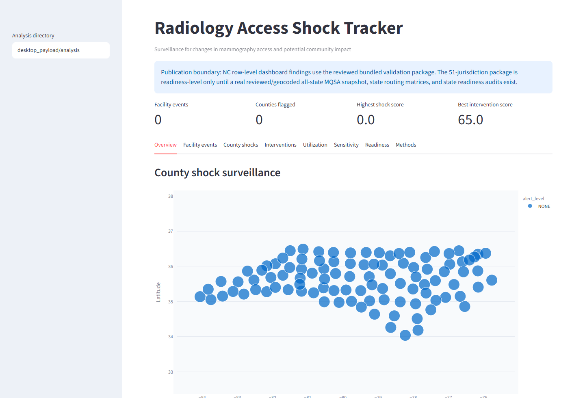

# Radiology Access Shock Tracker

[](https://github.com/AKaturu/radiology-access-shock-tracker/actions/workflows/tests.yml)

An open-source surveillance toolkit for detecting changes in mammography access, estimating which communities are affected, and comparing candidate response locations.

## Evidence Status

| Evidence | Status |
|---|---|
| Unit and integration tests | Complete (pytest, ruff, and mypy passing) |
| Synthetic end-to-end evaluation | Complete |
| Public-data evaluation | Production-ready all-state package audit complete for 51 jurisdictions (50 states + DC); reviewed NC package retained as the current row-level validation artifact |
| Independent expert review | Review packet ready; independent review not completed |
| Institutional validation | Not completed |
| Prospective clinical validation | Not completed |

This software is a research prototype and is not intended for independent clinical decision-making.

## Clinical Problem

Facility closures, relocations, and service reductions affect mammography access for specific communities. The FDA MQSA public file does not contain stable tracker IDs, coordinates, active status, or facility-level annual capacity. This project provides a rigorous, reproducible surveillance framework that keeps facility-change signals as verification prompts rather than definitive closure claims.

The `radshock demo` command creates **synthetic North Carolina-like data** and must not be interpreted as a real facility or utilization assessment. The public project uses synthetic data so it is easy to run and review. Reviewed real-data packages are documented separately.

## Dashboard Preview



Walkthrough footage and more screenshots are in [docs/GITHUB_PAGE_ASSETS.md](docs/GITHUB_PAGE_ASSETS.md).

## Current Production Status

The all-state data package is ready for publication-gate use:

- 51 jurisdictions in scope: 50 states + DC
- FDA MQSA, HRSA, CDC PLACES, CDC/ATSDR SVI, Census Gazetteer, and ACS context covered for all 51 jurisdictions
- ACS county context: 51/51 jurisdictions
- ACS tract context: 51/51 jurisdictions
- State readiness gates: 153/153 resolved with user-attested human-review evidence
- Production completion audit: `READY`, 0 blockers, 0 warnings

The project intentionally does **not** publish placeholder all-state facility snapshots. A future
facility snapshot must be generated from an actually reviewed MQSA CSV with real facility IDs,
coordinates, active flags, and approved review statuses.

## Capabilities

- Versions dated facility snapshots with SHA-256 checksums and metadata
- Detects new listings, possible closures, relocations, status changes, renames, and capacity reductions
- Calculates population-weighted distance or reviewed travel time to nearest active facility
- Produces vulnerability-adjusted county shock score and alert level
- Re-scores under alternative weighting assumptions and emits reviewer-facing sensitivity reports
- Audits analysis packages for publication-readiness blockers and provenance gaps
- Audits project-level production completion gates for owners, credentials, all-state coverage, ACS context, and readiness reports
- Emits state-by-state all-state package readiness gates before non-NC publication
- Generates data-quality, geocoder-confidence, identifier-crosswalk, and route-uncertainty reports for production review
- Summarizes before/after screening utilization signals
- Ranks hypothetical mobile or fixed-site locations by geographic access recovery
- FDA MQSA source-refresh workflow with human-review gate
- FDA MQSA, Census ACS/Gazetteer, CDC PLACES, CDC/ATSDR SVI, and HRSA review inputs support a 51-jurisdiction scope including DC
- Manual all-state package workflow rebuilds ACS county and tract context from `CENSUS_API_KEY`
- Desktop release workflow builds Windows, macOS, and Linux dashboard downloads
- Dependabot, CodeQL, pinned GitHub Actions, release checksums, and SBOM generation harden the supply chain
- Structured GitHub issue forms capture expert review, MQSA refresh review, all-state snapshot
  intake, release trust, and external-validation evidence
- Manuscript package builder emits Word and PDF drafts from the bounded manuscript source with
  numbered references and figures
- Dashboard displays the publication boundary between reviewed NC row-level findings and
  all-state readiness-only package evidence
- Streamlit dashboard, Markdown policy brief exports, and sensitivity-review downloads

## Quick Start

```bash
pip install -e ".[dev]"
radshock demo --output-dir outputs/demo
streamlit run src/radshock/app.py
```

Then open the local Streamlit URL shown in the terminal.

## Use the Reviewed Real-Data Package

```bash
$env:RADSHOCK_ANALYSIS_DIR = "desktop_payload/analysis"
streamlit run src/radshock/app.py
```

The reviewed real NC no-observed-change validation package supports workflow and methods claims, but not trend, deterioration, or causal utilization claims.

## Limitations

- Facility disappearances are labeled `POSSIBLE_CLOSURE`, not confirmed closure
- Great-circle distance is the default demo method; travel-time matrices require reviewed routing
- Census ACS API queries require an API key
- CDC/ATSDR SVI is contextual vulnerability data, not a mammography access or outcomes measure
- Desktop artifacts are unsigned; public releases may trigger SmartScreen/Gatekeeper warnings
- Release checksum and SBOM files verify artifact integrity and dependency inventory, but do not replace code signing or notarization
- Sensitivity scenarios test score robustness but do not clinically validate the score
- Reviewed dashboard findings are currently limited to the bundled North Carolina package; the all-state package is production-audit ready, but row-level all-state facility snapshots must still come from reviewed/geocoded MQSA rows before publication

## Documentation

| Topic | File |
|---|---|
| Methodology (formulas, thresholds, limitations) | [docs/METHODS.md](docs/METHODS.md) |
| Architecture | [docs/ARCHITECTURE.md](docs/ARCHITECTURE.md) |
| Data sources (FDA, Census, CDC, HRSA, CMS) | [docs/DATA_SOURCES.md](docs/DATA_SOURCES.md) |
| Operations and credentials | [docs/OPERATIONS.md](docs/OPERATIONS.md) |
| Desktop releases | [docs/DESKTOP_RELEASES.md](docs/DESKTOP_RELEASES.md) |
| Roadmap | [docs/ROADMAP.md](docs/ROADMAP.md) |
| GitHub publishing | [docs/GITHUB_PUBLISHING.md](docs/GITHUB_PUBLISHING.md) |
| Expert review packet | [docs/EXPERT_REVIEW_PACKET.md](docs/EXPERT_REVIEW_PACKET.md) |
| Journal report packaging | [docs/JOURNAL_REPORT_PACKAGE.md](docs/JOURNAL_REPORT_PACKAGE.md) |
| Manuscript working draft | [docs/MANUSCRIPT_DRAFT.md](docs/MANUSCRIPT_DRAFT.md) |
| GitHub page assets | [docs/GITHUB_PAGE_ASSETS.md](docs/GITHUB_PAGE_ASSETS.md) |
| Contribution guide | [CONTRIBUTING.md](CONTRIBUTING.md) |
| Security reporting | [SECURITY.md](SECURITY.md) |

## License

MIT. See [LICENSE](LICENSE). Public-source datasets remain governed by their respective source terms.
