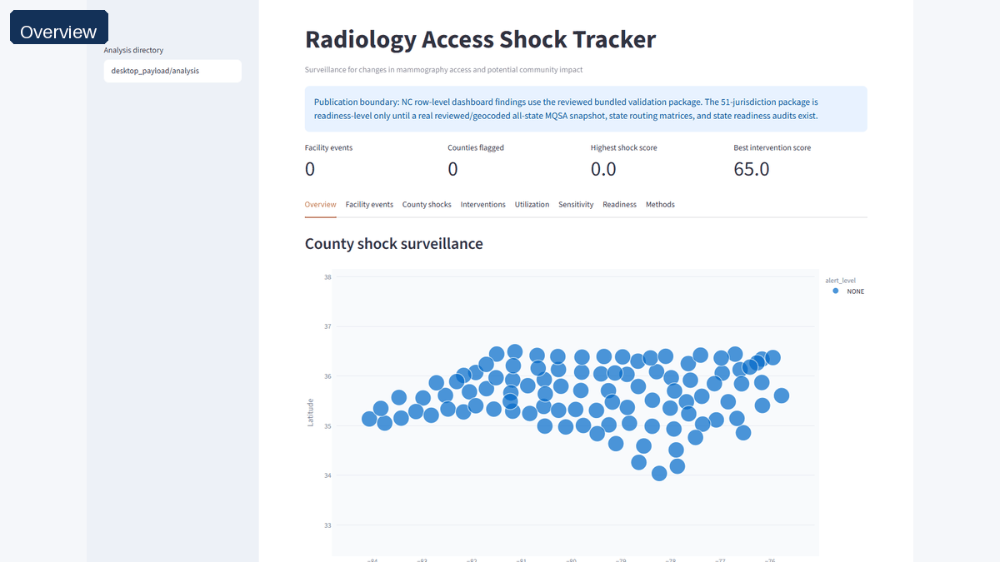

# GitHub Page Assets

These assets are ready for a README, GitHub Pages page, or release notes. The current checked-in
screenshots and guided walkthrough are captured from the bundled reviewed North Carolina validation
package in `desktop_payload/analysis`. They show the product UI and publication-boundary messaging;
they do not publish all-state row-level findings.

The walkthrough is a 16:9 WebM generated by `scripts/capture_github_assets.mjs`. It hides Streamlit
chrome, steps through the main dashboard tabs, and adds short capture-only captions for release and
GitHub-page viewers.

## README Preview

GitHub repository Markdown does not render HTML video players. The README therefore uses a short
animated GIF that links to the full browser-playable WebM hosted through jsDelivr:

```markdown
[](https://cdn.jsdelivr.net/gh/AKaturu/radiology-access-shock-tracker@main/docs/assets/github/dashboard-walkthrough.webm)
```

[](https://cdn.jsdelivr.net/gh/AKaturu/radiology-access-shock-tracker@main/docs/assets/github/dashboard-walkthrough.webm)

The GIF cycles through overview, county-shock, intervention, and readiness-audit screens. It is
generated from the reviewed screenshot set, not from synthetic or all-state row-level findings.

## Walkthrough Footage

Use this as linked walkthrough footage:

```markdown
[Watch dashboard walkthrough](docs/assets/github/dashboard-walkthrough.webm)
```

[Watch dashboard walkthrough](assets/github/dashboard-walkthrough.webm)

## Screenshot Set

- [Overview dashboard](assets/github/dashboard-overview.png)
- [County shocks table](assets/github/county-shocks.png)
- [Intervention ranking](assets/github/interventions.png)
- [Sensitivity review](assets/github/sensitivity.png)
- [Readiness audit](assets/github/readiness-audit.png)
- [Mobile overview](assets/github/mobile-overview.png)

## Regenerate

Start the app with the bundled reviewed validation package, then run the capture script:

```powershell
$env:RADSHOCK_ANALYSIS_DIR = "desktop_payload/analysis"
streamlit run src/radshock/app.py --server.port 8765

$env:RADSHOCK_CAPTURE_URL = "http://127.0.0.1:8765"
node scripts/capture_github_assets.mjs

pip install -e ".[media]"
python scripts/build_github_readme_preview.py
```

The script uses `RADSHOCK_CAPTURE_URL`, `RADSHOCK_CAPTURE_OUTPUT`, and
`RADSHOCK_CHROMIUM_EXECUTABLE` if you need a different app URL, destination directory, or browser.
It fails by default if the loaded dashboard shows the synthetic-data warning. To intentionally
capture the synthetic demo instead, regenerate it with `radshock demo`, set
`RADSHOCK_ANALYSIS_DIR=outputs/demo/analysis`, and set `RADSHOCK_CAPTURE_ALLOW_SYNTHETIC=1`.

`build_github_readme_preview.py` reads the four reviewed screenshots in
`docs/assets/github`, builds `dashboard-walkthrough.gif`, and fails if a required screenshot is
missing. It deliberately does not alter the full walkthrough recording.
