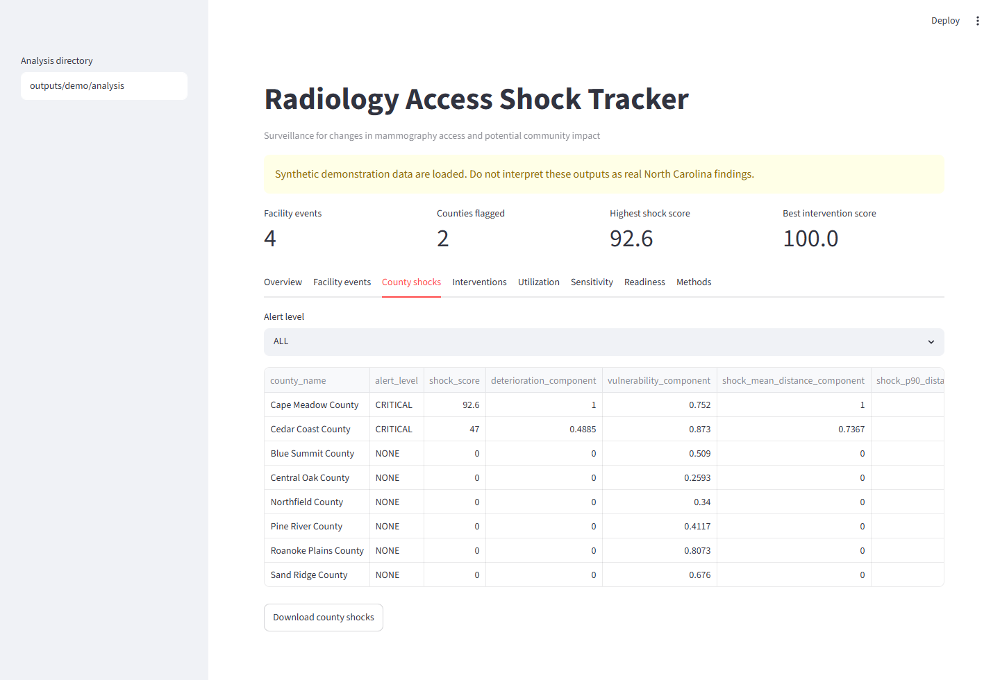
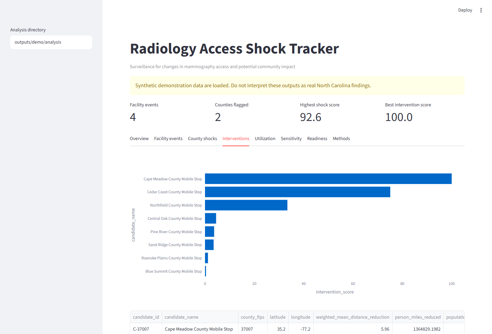
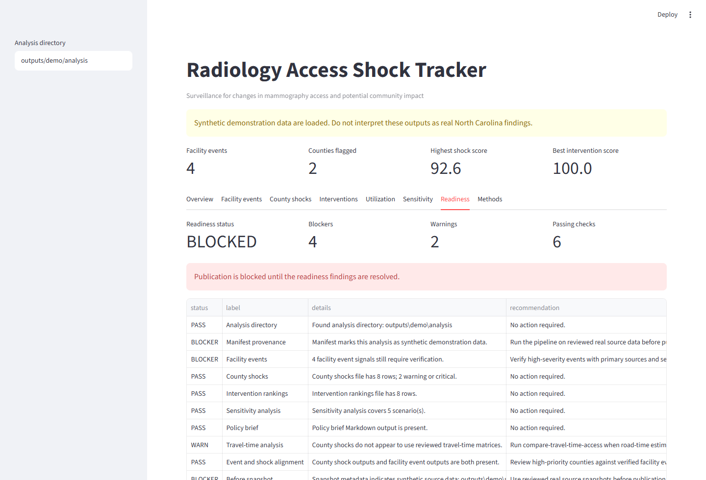

# Radiology Access Shock Tracker

An open-source surveillance toolkit for detecting changes in mammography access, estimating which
communities are affected, and reviewing candidate response locations.


## Current Status

The public GitHub demo uses synthetic North Carolina-like data. The warning banner in the
screenshots is intentional: synthetic outputs are not real North Carolina findings and are blocked
by the readiness audit.

Synthetic demo signals:

- 4 synthetic facility event signals.
- 2 synthetic counties flagged.
- Synthetic readiness audit: `BLOCKED`.
- The blocked audit demonstrates the publication-readiness gate.

Reviewed real-data package:

- Preserved separately in `desktop_payload/analysis` and the journal bundle.
- Uses reviewed NC MQSA snapshots for `2026-06-19` and `2026-06-20`.
- Uses a self-hosted OSRM route-time matrix.
- Readiness audit: `READY`, 0 blockers, 0 warnings.
- Supports a no-observed-change validation run, not trend, deterioration, or causal claims.

## Screenshots







## Reproducibility

Key references:

- Project README in the repository root
- [Methods](METHODS.md)
- [Data sources](DATA_SOURCES.md)
- [Operations](OPERATIONS.md)
- [Compiled validation report](validation/COMPILED_TEST_REPORT.md)
- [GitHub publishing guide](GITHUB_PUBLISHING.md)
- [Desktop downloads](DESKTOP_RELEASES.md)
- [Journal report package guide](JOURNAL_REPORT_PACKAGE.md)

Core validation:

```text
python -m pytest: 80 passed
ruff check: passed
mypy src/radshock: passed
synthetic demo readiness audit: BLOCKED as expected
reviewed real-data readiness audit: READY, 0 blockers, 0 warnings
```

## Responsible Use

Synthetic demo outputs are for software review only. Reviewed facility events are surveillance
signals requiring source verification. Candidate response rankings are planning assumptions and do
not indicate that a listed site currently provides mammography. The exploratory shock score is
transparent and reproducible, but it is not a clinically validated measure.
