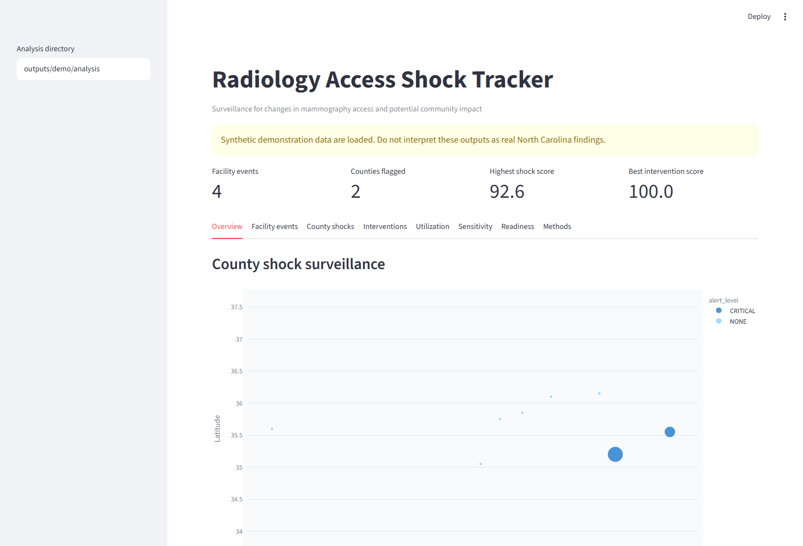
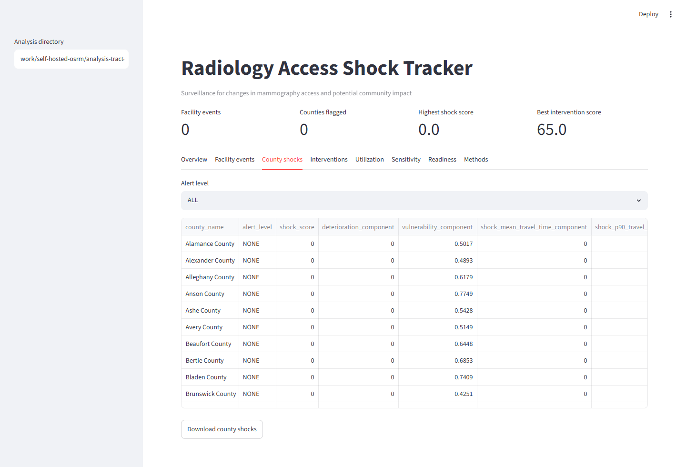
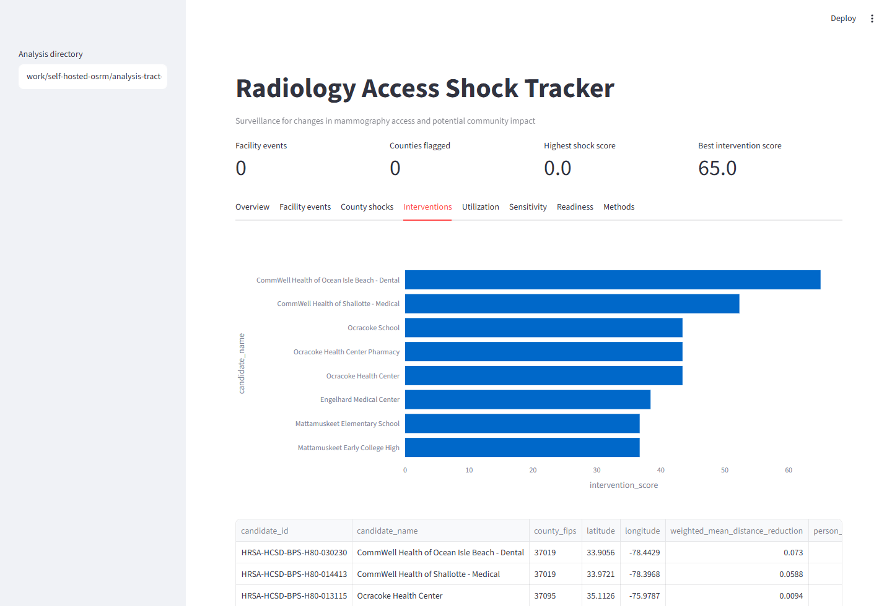
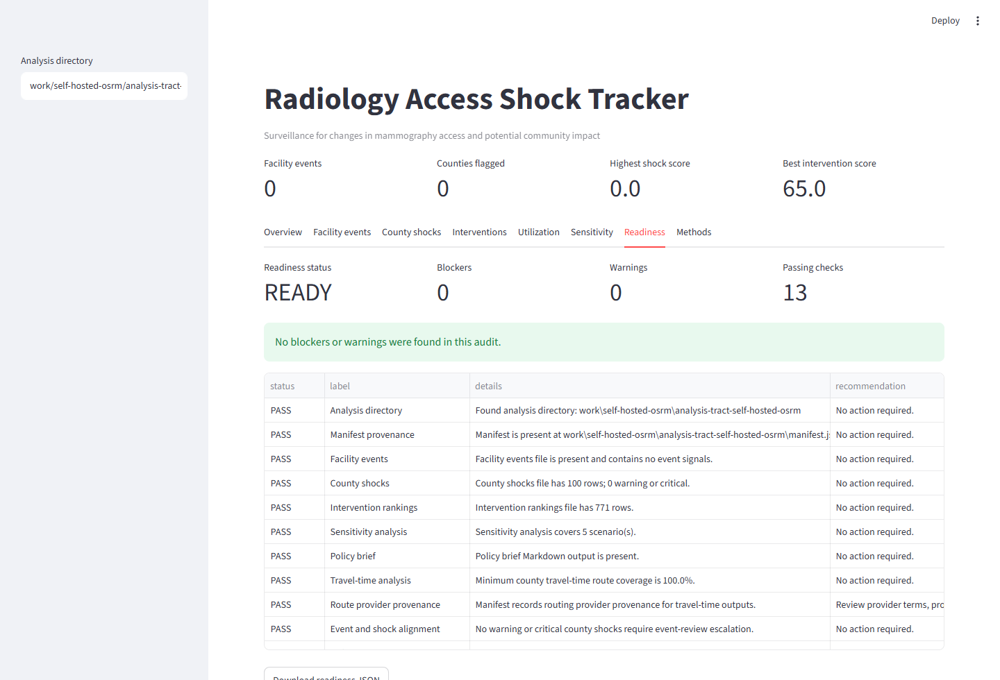

# Radiology Access Shock Tracker

An open-source surveillance toolkit for detecting changes in mammography access, estimating which
communities are affected, and reviewing candidate response locations.



## Current Status

The local self-hosted OSRM production package is readiness `READY` with 0 blockers and 0 warnings.
It uses reviewed North Carolina MQSA facility snapshots for `2026-06-19` and `2026-06-20`, tract
population points, HRSA service-delivery candidate assumptions, and a self-hosted OSRM route-time
matrix.

Current real-data boundary:

- 289 active NC MQSA facility records in each reviewed snapshot.
- 52,680 of 52,680 tract-nearest facility route pairs routed.
- 0 unreachable route rows.
- 0 facility event signals between `2026-06-19` and `2026-06-20`.
- 0 warning or critical county shocks.
- 771 HRSA service-delivery candidate assumptions for response-site planning review.

This result supports a no-observed-change validation run for the reviewed dates. It does not support
trend, deterioration, or causal claims until a later FDA MQSA source update is reviewed.

## Screenshots







## Reproducibility

Key references:

- Project README in the repository root
- [Methods](METHODS.md)
- [Data sources](DATA_SOURCES.md)
- [Operations](OPERATIONS.md)
- [Compiled validation report](validation/COMPILED_TEST_REPORT.md)
- [GitHub publishing guide](GITHUB_PUBLISHING.md)
- [Desktop downloads](DESKTOP_RELEASES.md)
- [Journal report package guide](JOURNAL_REPORT_PACKAGE.md)

Core validation:

```text
python -m pytest: 79 passed
ruff check: passed
mypy src/radshock: passed
self-hosted OSRM readiness audit: READY, 0 blockers, 0 warnings
```

## Responsible Use

Facility events are surveillance signals requiring source verification. Candidate response rankings
are planning assumptions and do not indicate that a listed site currently provides mammography.
The exploratory shock score is transparent and reproducible, but it is not a clinically validated
measure.
